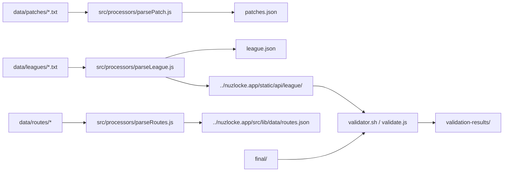

# Nuzlocke Data (nuzlocke.data)

This repository holds the text-based source data used to generate the JSON data consumed by the nuzlocke.app project. It contains "patches" (romhack overrides), league/boss definitions, and route encounter lists. The authoritative README in this repo has been replaced by this NEW_README.md — follow the steps below to generate, validate, and contribute data.

---

## Quick summary / intent

- Input: `data/patches/*.txt`, `data/leagues/*.txt`, and `data/routes/*` text files.
- Processors: `src/processors/parsePatch.js`, `src/processors/parseLeague.js`, and `src/processors/parseRoutes.js`.
- Intermediate: `patches.json`, `league.json` (in this repo), and per-game JSON files written into the sibling `nuzlocke.app` repo.
- Output locations expected by the app: `../nuzlocke.app/static/api/league/*` and `../nuzlocke.app/src/lib/data/routes.json` (for route metadata).

### Flow diagram



This repository is intended to be used alongside a sibling checkout of the nuzlocke.app repository at the same parent directory (i.e., `../nuzlocke.app`). The generator scripts rely on several JSON files inside that app repository (moves, items, abilities, games metadata, and a pokemon index).

---

## Prerequisites

- Node.js (LTS recommended; Node 18+ tested). Run `node -v` to check. Some modern JS features (e.g. `String.prototype.replaceAll`) are used.
- Git and a checked-out `nuzlocke.app` repository in the parent directory: `../nuzlocke.app`.
- Optional tooling: `just` if you want to use the provided justfile recipes (see below). On macOS: `brew install just`; on Linux check your package manager or build from source.

Notes about `nuzlocke.app` expectations
- parseLeague.js reads several files inside the sibling `nuzlocke.app` repo. Ensure these paths exist (the exact files used are):
  - `../nuzlocke.app/src/lib/data/games.json`
  - `../nuzlocke.app/src/routes/assets/data/items.json`
  - `../nuzlocke.app/src/routes/assets/data/abilities.json`
  - `../nuzlocke.app/src/routes/assets/data/moves.json`
  - `../nuzlocke.app/src/routes/api/pokemon.json/_pokemon.json` (this repo expects a _pokemon.json file under a folder named `pokemon.json` in that path; see Troubleshooting below if this is unexpected)

If any of these files are missing, parseLeague.js will fail. You may need to run a build or export step in the `nuzlocke.app` repo first (check that repo's docs for assembling `src/routes/assets/data`).

---

## Repository layout (key files / directories)

- `data/patches/` — text files per-game describing changes to abilities, moves, items, pokemon, and fakemon for romhacks
- `data/leagues/` — per-game boss/leader files (.txt or .league) describing battles and pokemon loadouts
- `data/routes/` — route encounter lists and optional boss markers
- `src/processors/parsePatch.js` — reads `data/patches/*.txt` and writes `patches.json`
- `src/processors/parseLeague.js` — reads `data/leagues/*.txt`, uses `patches.json` + data from `nuzlocke.app` to generate enriched league JSON and per-game JSON files
- `src/processors/parseRoutes.js` — compiles `routes/*` into a `routes.json` file intended for the app
- `validate.js` & `validator.sh` — helpers to compare generated files between this repo and `nuzlocke.app` outputs
- `final/` — (historical) output JSON files (used for validation comparison)
- `patches.json`, `league.json` (top-level artifacts produced by the scripts)

---

## Generate data (recommended flow)

1. Ensure `nuzlocke.app` is checked out as a sibling folder next to this repo. Example:

```bash
# run from the parent directory that will contain both repos
git clone <nuzlocke.app-repo-url> nuzlocke.app
git clone <this-repo-url> nuzlocke.data
cd nuzlocke.data
```

2. Check your Node version:

```bash
node -v
# recommend v18.x or later
```

3. Generate patched data and enriched league/game JSON files (the `generate` npm script runs both steps):

```bash
# from the nuzlocke.data repo root
npm run generate
# this executes: node src/processors/parsePatch.js && node src/processors/parseLeague.js
```

What happens:
- `src/processors/parsePatch.js` reads `data/patches/*.txt` and writes `patches.json` (in this repo).
- `src/processors/parseLeague.js` reads `data/leagues/*.txt` and `patches.json`, merges data with the app's base JSON (moves, items, abilities, pokemon data) and writes:
  - `league.json` (aggregated enriched league data inside this repo)
  - per-game JSON files into the sibling app at `../nuzlocke.app/static/api/league/` and also into this repo's `final/` directory (if present)

4. Generate routes (optional):

```bash
# parseRoutes.js uses ES module syntax. Try running the script directly:
node src/processors/parseRoutes.js
```

If that fails due to ESM/module config, see Troubleshooting below (you can either run Node with module support, convert `parseRoutes.js` to CommonJS, or add a minimal wrapper).

---

## Validate

A script is included to compare the per-game JSON files produced in `../nuzlocke.app/static/api/league` with the historical outputs in `final/`.

```bash
npm run validate
# runs: bash validator.sh
# output files: validation-results/*.txt
```

The validator writes textual diffs into `validation-results/`. Review those files to find differences between the two sources. There are two validator helpers included: `validate.js` and `compareJsonAllDiffsUnorderedArrays.js` to assist in different comparison styles.

---

## File formats (how to author data)

Below are short examples and explanations. The generator scripts are the source of truth; if you edit formats here, update the scripts.

Patches (`data/patches/*.txt`)
- Files are split into sections using lines that start with `--<section>` (e.g., `--item`, `--move`, `--ability`, `--pokemon`, `--fakemon`).
- Lines inside a section are pipe-delimited. Examples:

```
--item
sitrus-berry|sitrus.png|Restores 25% HP when at 50% or below

--move
flameburst|fire|70|A burst of flame|Special|Flame Burst

--ability
overgrow|Powers up Grass-type moves when HP is low

--pokemon
,100, ---- empty leading fields allowed to only override specific stats

--fakemon
60,80,50,90,55,70|FakemonName|alias>sprite.png|fire,dragon|/images/fakemon.png|--evo-line>evo1,evo2
```

Notes:
- See `parsePatch.js` for exact parsing details — it builds `patches.json` where each section becomes a JSON object keyed by slug or name.

Leagues (`data/leagues/*.txt`)
- Each boss block begins with a leader header line like:

```
--1|Brock|Rock|/path/to/image.png@Author@https://author.link
```

- An optional options line may follow beginning with `==` (double battles, custom HTML, etc.).
- Pokemon lines: `name|level|move1,move2,move3,move4|ability|held-item|starter|tera-type`
- Alternate sprite format: `pokemon>sprite|level@evs|m1,m2,m3,m4|ability|held` (see `parseLeague.js` for parsing rules).

Routes (`data/routes/*`)
- Each file is processed into a list of entries. Lines starting with `--` are gym/battle entries with `--name|id|group|boss`.
- Normal route lines: `Route name|encounter1,encounter2`.

---

## Troubleshooting / Known issues

- parseRoutes.js is written using ESM (`import`) and contains a Windows-style `..\\nuzlocke.app\\...` path in its output file string. If you get module errors when running `node parseRoutes.js`, run it via dynamic import (see "Generate routes" above) or convert it to CommonJS by changing `import fs from 'fs'` to `const fs = require('fs')` and adjusting any ESM-only syntax.
- parseLeague.js expects a peculiar `pokemon` path: `../nuzlocke.app/src/routes/api/pokemon.json/_pokemon.json`. Some app builds place Pokemon JSON in a different location; if you see an error about a missing file, inspect the sibling app repo and either copy the required JSON there or adjust parseLeague.js (recommended minimal fix: point `pokemonPath` to the proper file in `nuzlocke.app`).
- Node version: use Node 18+ to avoid runtime issues with newer JS APIs.

---

## Contributing

1. Add or edit files under `data/patches/`, `data/leagues/`, or `data/routes/` following the formats above.
2. Run `npm run generate` locally to produce `patches.json` and updated league/game JSON.
3. Run `npm run validate` to compare results and check for unintended differences.
4. Open a PR with your `.txt` files and a short description of the changes. The repo owner will run the build/validation workflow and merge if all is OK.

If you're unsure how to author a file, open an issue or request help — maintainers can provide examples and guidance.

---

## Optional fixes (small, safe changes to consider)

If you want to make the developer experience smoother, consider:
- Convert `parseRoutes.js` to CommonJS or rename to `parseRoutes.mjs` and add a note in package.json to allow ESM.
- Fix the `pokemonPath` resolved location in `parseLeague.js` if your `nuzlocke.app` checkout stores that data in a different place.
- Add `parseRoutes` to the `generate` npm script if you want routes compiled automatically.

---

## Example quick commands

```bash
# Generate patches + leagues
npm run generate

# Generate routes (if desired)
node src/processors/parseRoutes.js

# Validate
npm run validate
```

---

If anything is missing or you want these docs tweaked to include step-by-step screenshots or CI examples, reply and I will adjust the README or create a Makefile/CI workflow as requested.
